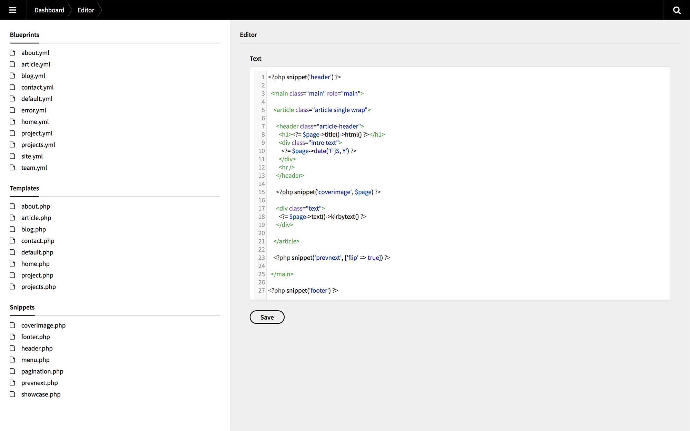

# Kirby Code Editor

Experimental plugin (pre-alpha). Don't blame me if you havoc your Kirby installation.

Edit blueprints, templates and snippets in the Panel.



**Note:** For the plugin to load the required JS files, you might have to uncomment these two lines in Kirby's `.htaccess` file (i.e. remove the `#`):

```
# RewriteRule ^assets/plugins/([a-zA-Z0-9\.\-_%=]+)/(.*)$ site/plugins/$1/assets/$2 [L,N]
# RewriteCond $1 !^plugins/[a-zA-Z0-9\.\-_%=]+/assets/.*
```

## Usage limitations
It is discouraged to use this plugin in any project that promotes racism, sexism, homophobia, animal abuse, violence or any other form of hate speech.

## Author
Sonja Broda - <https://www.texniq.de>
